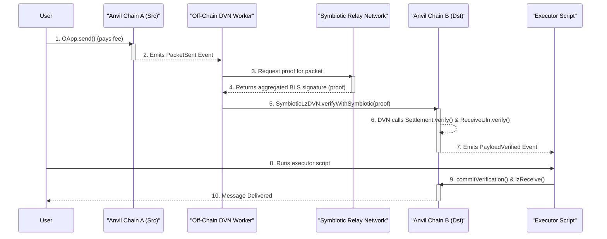

# LayerZero DVN Secured by Symbiotic

This project demonstrates a powerful integration between LayerZero's omnichain messaging protocol and Symbiotic's economic security framework. It replaces a standard LayerZero Decentralized Verifier Network (DVN) with one whose security is derived directly from the economic stake managed by a Symbiotic validator set.

This repository is a fusion of two core concepts:
-   **[aid-contracts](https://github.com/gaib-ai/aid-contracts)**: Provides a high-fidelity local testing environment for a complete LayerZero V2 deployment, including a cross-chain application (OApp).
-   **[symbiotic-super-sum](https://github.com/symbioticfi/symbiotic-super-sum)**: Provides a Dockerized, multi-chain local testnet and an off-chain worker infrastructure powered by the Symbiotic Relay SDK.

By combining these, we create a fully-functional prototype of a DVN where packet verification is backed by real economic stake, rather than a simple multi-sig of trusted addresses.

---

## Architecture Overview

The system runs a local, containerized network consisting of two independent blockchains (Anvil instances), a full Symbiotic Relay network, and a dedicated off-chain worker that acts as the DVN.

### Key On-Chain Components

-   **`SymbioticLzDVN.sol`**: A custom LayerZero DVN contract.
    -   **On the source chain**, it implements the `IDVN` interface to provide fee quotes for its verification services.
    -   **On the destination chain**, it exposes a `verifyWithSymbiotic` function, which accepts a proof from the Symbiotic network.
-   **`ReceiveUlnSymbiotic.sol`**: A custom LayerZero Message Library (ULN).
    -   This library replaces the standard `ReceiveUln302`.
    -   It is configured to trust *only* the `SymbioticLzDVN` contract as a valid verifier.
    -   When `verifyWithSymbiotic` is successfully called on the DVN contract, the DVN contract then calls this library to officially record the verification for LayerZero's `EndpointV2`.
-   **Symbiotic Stack**: The full suite of Symbiotic contracts (`Settlement`, `ValSetDriver`, `KeyRegistry`, etc.) are deployed on both chains to manage the validator set and verify aggregated BLS signatures.
-   **LayerZero Stack**: The standard `EndpointV2` and `SendUln302` contracts are deployed, along with the `AID` OFT application as the example cross-chain app.

### Off-Chain Nodes (`dvn-node`)

This project runs multiple instances of a Go application that acts as the bridge between the two protocols. Each `dvn-node` performs the following steps:
1.  **Listens** for `PacketSent` events on the source chain's LayerZero `EndpointV2`.
2.  Upon receiving an event, all nodes will **construct a task** for the Symbiotic relay network.
3.  Each node **requests a proof** (an aggregated BLS signature) from its local `relay-sidecar` network.
4.  The nodes then **race to submit a transaction** to the `SymbioticLzDVN` contract on the destination chain. Only the first transaction will succeed; others will fail, which is expected behavior in a decentralized network simulation.
5.  This action completes the verification, allowing the cross-chain message to be executed by a separate Executor.

##### DVN Node Identity and Funding

It's important to note that the `generate_network.sh` script automatically creates a unique Ethereum wallet (private key and address) for each `dvn-node` instance that is generated. These keys are stored in `deploy-data/keys/dvn-node-*.key`.

-   **In the Default Local Environment**: The local Anvil nodes are configured to automatically fund any new address generated by `cast wallet new`. Therefore, when running the project locally with the provided scripts, **you do not need to do anything**. The `dvn-node` accounts will have more than enough ETH to pay for gas.

-   **On Other Testnets**: If you were to adapt this project for a public testnet (e.g., Sepolia), you would need to fund these generated addresses manually. You could get the address from the key file using `cast wallet address <private_key>` or by inspecting the file content, and then use a public faucet to send test ETH to it.

### Workflow Sequence Diagram



### Deployed Contracts in the Local Environment

The `SymbioticLzDvnDeploy.s.sol` script deploys a complete set of contracts on *each* of the two local chains.

#### Application Layer Contracts (OApp)
| Contract | Role |
| :--- | :--- |
| `AID` | The core ERC-20 token contract, using upgradeable proxies. |
| `Minter` | Mints new `AID` tokens against a stablecoin (`MockERC20`). |
| `MockERC20` | A mock stablecoin used as collateral. |
| `AidOFTAdapter` | The OApp entry point, initiating cross-chain transfers. |
| `AidOFTMintBurner` | Handles the burning and minting of `AID` across chains. |

#### LayerZero v2 Protocol Stack
| Contract | Role |
| :--- | :--- |
| `EndpointV2` | The main LayerZero entry point on each chain. |
| `SendUln302` | The "send" message library for fee calculation and packet formatting. |
| `ReceiveUlnSymbiotic`| **Custom** "receive" library that verifies proofs via the `SymbioticLzDVN`.|
| `PriceFeed` | Provides gas price data for fee calculation. |
| `SymbioticLzDVN`| **Custom** DVN contract that provides fee quotes and verifies proofs against the Symbiotic `Settlement` contract. |
| `Executor` | A standard LayerZero contract for message delivery (simulated via script). |

#### Symbiotic Protocol Stack
| Contract | Role |
| :--- | :--- |
| `SymbioticCore` | The set of core contracts managing vaults, operators, and networks. |
| `KeyRegistry` | Stores operators’ BLS and ECDSA keys. |
| `VotingPowers` | Derives validator voting power from vault stakes. |
| `ValSetDriver` | Exposes epoched validator sets to the off-chain relay nodes. |
| `Settlement` | Per-chain contract that verifies aggregated BLS signatures from the relay network. |

---

## Local Simulation vs. Production System

It is crucial to understand that this project provides a **high-fidelity logical simulation**, not a production-ready system. The `dvn-worker` and Forge-based `Executor` are designed for local testing and verification of on-chain logic. Building and operating resilient, secure off-chain services requires significant additional engineering effort.

**What's Not Included (The Path to a Production System):**

*   **Production-Grade Service Architecture:** The `dvn-worker` is a simple application. A real-world system requires continuously running, fault-tolerant services with robust process management, automated restarts, and comprehensive logging.
*   **Persistent State Management:** Production workers need a robust database (e.g., PostgreSQL) to track in-flight messages, transaction statuses, and retry counts to ensure data integrity during service restarts.
*   **Secure Private Key Management:** Using private keys from a local `.env` file is insecure. A live system demands a secure key management solution like HashiCorp Vault.
*   **RPC Redundancy and Error Handling:** Production services must handle RPC provider downtime by implementing logic for failover to redundant nodes and sophisticated retry mechanisms.
*   **Dynamic Gas Price Management:** A production worker must implement a dynamic gas fee strategy, likely integrating with gas station APIs, to ensure transactions are mined in a timely and cost-effective manner.
*   **Real Economic Security:** This simulation uses mock staking tokens. A production system involves real assets and a carefully designed economic model with staking rewards and slashing conditions for misbehavior.

---

## Quick Start: End-to-End Local Test

This guide will walk you through setting up the local network, deploying all contracts, and sending a cross-chain transaction.

### Prerequisites

-   [Docker](https://www.docker.com/get-started) and Docker Compose
-   [Foundry](https://getfoundry.sh/)

### Installation and Setup

1.  **Clone the Repository**
    ```bash
    git clone --recursive <your-repo-url>
    cd <your-repo-name>
    ```
    *Note: The `--recursive` flag is important as it automatically initializes and clones the git submodules.*

2.  **Install Submodules Manually (if needed)**
    If you cloned the repository without the `--recursive` flag, you can initialize the submodules manually:
    ```bash
    git submodule update --init --recursive
    ```

3.  **Install LayerZero Dependencies**
    The LayerZero v2 library requires certain NodeJS packages.
    ```bash
    cd lib/LayerZero-v2
    npm install
    cd ../..
    ```

4.  **Fix OpenZeppelin v5 Import Paths**
    This project uses both v4 and v5 of OpenZeppelin contracts to maintain compatibility with its dependencies while using modern features. The default import path points to v4, which causes compilation errors in the v5 upgradeable contracts. Run the following command to fix the import paths:
    ```bash
    find lib/openzeppelin-contracts-upgradeable-v5 -type f -name "*.sol" -exec sed -i '' 's|from "@openzeppelin/contracts/|from "@openzeppelin-v5/contracts/|g' {} +
    ```

### Step 1: Setup Environment File

The Forge scripts require a `PRIVATE_KEY` to be set in the environment. Copy the provided example file.

```bash
cp .env.example .env
```

### Step 2: Generate Network Configuration

This script creates a `temp-network` directory containing a `docker-compose.yml` file and a `.env` file for the DVN worker. You can configure the number of operators in the Symbiotic network.

```bash
./generate_network.sh
```

### Step 3: Start the Local Network

Navigate into the newly created directory and start all services in the background. This will pull necessary Docker images, build the `dvn-worker`, and start the two blockchains, the Symbiotic relay sidecars, and the DVN worker.

```bash
cd temp-network
docker compose up --build -d
```
The first startup may take a few minutes. You can monitor the progress with `docker compose logs -f`.

### Step 4: Deploy and Configure Contracts

Once all services are running, run the unified deployment script. This Forge script will deploy and configure the entire Symbiotic and LayerZero stack on both local chains.

```bash
forge script script/SymbioticLzDvnDeploy.s.sol --rpc-url http://localhost:8545 --broadcast --ffi
```
This will create a `dvn_deployment.json` file in `temp-network/deploy-data/` with the addresses of all deployed contracts.

### Step 5: Initiate a Cross-Chain Transaction

With everything deployed and running, use the `Bridge` script to send 50 `AID` tokens from Chain A (31337) to Chain B (31338).

```bash
forge script script/Bridge.s.sol --rpc-url http://localhost:8545 --broadcast --ffi
```

### Step 6: Process the Packet with Off-Chain Services

This step simulates the roles of both the DVN and the Executor.

1.  **Observe the DVN Nodes**: The `dvn-node` services are already running via Docker. Watch their logs to see them compete to process the packet:
    ```bash
    docker compose logs -f dvn-node-1 dvn-node-2 #... and so on
    ```
    You should see one node successfully submit the verification transaction, while others will report a (safe and expected) failure because the task was already processed.

2.  **Run the Executor**: After one of the DVN nodes has successfully submitted the verification, run the `Executor` script to complete the message delivery.
    ```bash
    forge script script/Executor.s.sol --rpc-url http://localhost:8546 --broadcast --ffi
    ```
    This script will commit the verification to the LayerZero Endpoint and execute the final `lzReceive` call.

### Step 7: Verify the Result

1.  **Watch the logs** of the `dvn-worker` to see the process in action:
    ```bash
    docker compose logs -f dvn-worker
    ```
    You should see output indicating that a `PacketSent` event was received, a proof was requested, and a verification transaction was submitted.

2.  **Verify the balance** on Chain B. Once the worker's logs show the transaction as successful, use `cast` to check your `AID` token balance on the destination chain.

    ```bash
    # Get your address from the private key
    SENDER=$(cast wallet address --private-key $(grep PRIVATE_KEY .env | cut -d '=' -f2))

    # Get the AID contract address on Chain B from the deployment file
    AID_B=$(jq -r '.chainB.aid' deploy-data/dvn_deployment.json)

    # Check the balance
    cast call $AID_B "balanceOf(address)" $SENDER --rpc-url http://localhost:8546 | cast --to-dec
    ```
    The result should be `50000000000000000000` (50 tokens with 18 decimals).

---

## Network Services

The local environment consists of the following services:

-   `anvil`: The source blockchain (Chain A, EID 31337) running on port `8545`.
-   `anvil-settlement`: The destination blockchain (Chain B, EID 31338) running on port `8546`.
-   `deployer`: A short-lived service that waits for the chains to be healthy.
-   `genesis-generator`: A short-lived service that generates the configuration for the Symbiotic relay network.
-   `relay-sidecar-*`: The nodes of the Symbiotic relay network.
-   `dvn-node-*`: The off-chain nodes that listen for LayerZero events and compete to submit Symbiotic-backed verifications.

## Cleanup

To stop and remove all running containers and networks, run the following command from within the `temp-network` directory:
```bash
docker compose down -v
```
