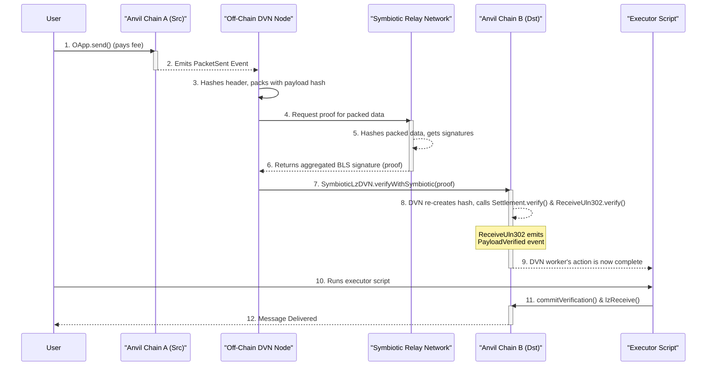

# LayerZero DVN Secured by Symbiotic

This project demonstrates a powerful integration between LayerZero's omnichain messaging protocol and Symbiotic's economic security framework. It replaces a standard LayerZero Decentralized Verifier Network (DVN) with one whose security is derived directly from the economic stake managed by a Symbiotic validator set.

This repository is a fusion of two core concepts:
-   **[aid-contracts](https://github.com/gaib-ai/aid-contracts)**: Provides a high-fidelity local testing environment for a complete LayerZero V2 deployment, including a cross-chain application (OApp).
-   **[symbiotic-super-sum](https://github.com/symbioticfi/symbiotic-super-sum)**: Provides a Dockerized, multi-chain local testnet and an off-chain worker infrastructure powered by the Symbiotic Relay SDK.

By combining these, we create a fully-functional prototype of a DVN where packet verification is backed by real economic stake, rather than a simple multi-sig of trusted addresses.

---

## Architecture Overview

The system runs a local, containerized network consisting of two independent blockchains (Anvil instances), a full Symbiotic Relay network, and a dedicated off-chain worker that acts as the DVN.

### Key On-Chain Components

-   **`SymbioticLzDVN.sol`**: A custom LayerZero DVN contract.
    -   **On the source chain**, it implements the `IDVN` interface to provide fee quotes for its verification services.
    -   **On the destination chain**, it exposes a `verifyWithSymbiotic` function. This function accepts a proof from the Symbiotic network, verifies it against the on-chain `Settlement` contract, and—if valid—calls the standard `ReceiveUln302.verify()` function to inform LayerZero of the successful verification.
-   **`ReceiveUln302.sol`**: The **standard** LayerZero "receive" Message Library.
    - It is *not* a custom contract. We use the official, audited version.
    - Through standard LayerZero configuration for the `AID` OApp, it is set up to trust *only* the `SymbioticLzDVN` contract's address as a valid verifier.
-   **Symbiotic & LayerZero Stacks**: The full suite of Symbiotic contracts (`Settlement`, `ValSetDriver`, etc.) and the standard LayerZero contracts (`EndpointV2`, `SendUln302`, etc.) are deployed. The Symbiotic contracts are deployed by the `LocalDeploy.s.sol` script during the Docker network setup, while the LayerZero stack and the `AID` OApp are deployed by the `SymbioticLzDvnDeploy.s.sol` script.

### Off-Chain Nodes (`dvn-node`)

This project runs multiple instances of a Go application that acts as the bridge between the two protocols. Each `dvn-node` performs the following steps:
1.  **Listens** for `PacketSent` events on the source chain's LayerZero `EndpointV2`.
2.  Upon receiving an event, all nodes will **construct a task** for the Symbiotic relay network.
3.  Each node **requests a proof** (an aggregated BLS signature) from its local `relay-sidecar` network.
4.  The nodes then **race to submit a verification transaction** to the `SymbioticLzDVN` contract on the destination chain. Due to the idempotent design of LayerZero's core contracts, multiple nodes may successfully submit this transaction on-chain. However, only the first transaction to be mined will change the packet's state to "verified". Subsequent transactions will succeed but have no further effect, consuming gas without altering the state. This is expected behavior in a decentralized network.
5.  This action completes the verification, allowing the cross-chain message to be executed by a separate Executor.

##### DVN Node Identity and Funding

A critical aspect of this local testnet is how the `dvn-node` instances are funded to pay for gas fees on the destination chain. The setup script orchestrates a three-step process to ensure each DVN node has a funded wallet without any manual intervention.

-   **1. Anvil Pre-Funded Accounts**: When the two Anvil blockchain containers start, they are configured to create 10 test accounts, each pre-funded with 10,000 test ETH. The first of these accounts is used by the `deployer` service.

-   **2. Operator Key Generation**: The `generate_network.sh` script deterministically generates a unique private key for each Symbiotic operator that will participate in the relay network. These keys are distinct from Anvil's default funded keys.

-   **3. Automated Funding Transfer**: During the network setup, the `deployer` service executes the `network-scripts/deploy.sh` script. This script performs its primary duty of deploying the Symbiotic contracts, and it also iterates through the generated operator addresses and **sends them test ETH** from its own pre-funded account.

-   **4. Shared Identity**: Finally, each `dvn-node` instance is configured to use the exact same private key as its corresponding Symbiotic operator. Because the operator address was funded in the previous step, the `dvn-node` automatically has a funded wallet, ready to submit verification transactions. This elegant design eliminates the need for a separate funding step for the DVN workers.

-   **On Other Testnets**: If you adapt this project for a public testnet, you would need to manually fund the operator addresses on all participating chains.

### The Intentional Separation of DVN and Executor Roles
This project's use of two distinct off-chain workers (`dvn-node` and the `Executor` script) is a direct reflection of LayerZero V2's core architectural principle: the separation of verification from execution.

*   **The DVN (`dvn-node`) handles Verification**: Its sole responsibility is security. It observes events on the source chain and provides proof to the destination chain that a given message is valid. It answers the question, "Did this message actually happen?"
*   **The Executor (`Executor.s.sol`) handles Execution**: Its responsibility is liveness and delivery. It takes a packet that has *already been verified* by the DVN and submits the transaction that delivers its payload to the final application. This role is permissionless; if a default executor fails to deliver a message, anyone can step in and execute it. This design prevents censorship and ensures that valid messages can always be delivered.

### Workflow Sequence Diagram



### Deployed Contracts in the Local Environment

The `SymbioticLzDvnDeploy.s.sol` script deploys a complete set of contracts on *each* of the two local chains.

#### Application Layer Contracts (OApp)
| Contract | Role |
| :--- | :--- |
| `AID` | The core ERC-20 token contract, using upgradeable proxies. |
| `Minter` | Mints new `AID` tokens against a stablecoin (`MockERC20`). |
| `MockERC20` | A mock stablecoin used as collateral. |
| `AidOFTAdapter` | The OApp entry point, responsible for initiating cross-chain `AID` transfers. |
| `AidOFTMintBurner` | Handles the burning and minting of `AID` tokens on behalf of the adapter. |

#### LayerZero v2 Protocol Stack
| Contract | Role |
| :--- | :--- |
| `EndpointV2` | The main LayerZero entry point on each chain for sending and receiving messages. |
| `SendUln302` | **Standard** "send" message library for fee calculation and packet formatting. |
| `ReceiveUln302`| **Standard** "receive" library, configured to trust our `SymbioticLzDVN` for this OApp. |
| `PriceFeed` | Provides gas price data for cross-chain fee calculation. |
| `SymbioticLzDVN`| **Custom** DVN contract that provides fee quotes and verifies proofs against the Symbiotic `Settlement` contract. |
| `Executor` | A standard LayerZero contract responsible for final message delivery. |

#### Symbiotic Protocol Stack
| Contract | Role |
| :--- | :--- |
| `Settlement` | Per-chain contract that verifies aggregated BLS signatures from the relay network. |
| `ValSetDriver` | Exposes epoched validator sets to the off-chain relay nodes. |
| `KeyRegistry` | Stores operators’ BLS and ECDSA keys. |
| `VotingPowerProvider` | Derives validator voting power from vault stakes. |
| *Core Contracts* | Other core contracts managing vaults, operators, and networks, deployed via the local setup scripts. |

---

## What's Included / Not Included

### What's Included: A High-Fidelity, End-to-End Local Simulation

This project provides a comprehensive and meticulously engineered local environment for testing the integration of a Symbiotic-backed DVN with LayerZero V2. A significant amount of work has been invested to ensure that this simulation is not merely functional, but a high-fidelity replica of a real-world, multi-chain deployment. It allows for rigorous, end-to-end testing of the entire cross-chain message lifecycle without any dependency on public testnets or external services.

Here’s a detailed breakdown of what this complex testing environment encompasses:

*   **Complete, Containerized Multi-Chain Environment:** This is far more than a unit test. The environment uses Docker to programmatically deploy and configure two independent, locally running Anvil blockchains, along with a complete off-chain network of Symbiotic relayers and DVN workers.

*   **Full Symbiotic Protocol Stack Deployment:** The environment deploys and configures the *entire* Symbiotic protocol stack from scratch on the local chains. This includes:
    *   `Settlement`, `ValSetDriver`, `KeyRegistry`, and `VotingPowerProvider` contracts.
    *   Configuration of a validator set with distinct operator keys and mock economic stake.
    *   An off-chain network of Symbiotic relay sidecars that can produce aggregated BLS signature proofs for arbitrary data payloads.

*   **Full LayerZero V2 Protocol Stack Deployment:** Alongside Symbiotic, the simulation deploys the complete LayerZero V2 stack:
    *   `EndpointV2`, `SendUln302`, `ReceiveUln302`, and `PriceFeed` contracts on each chain.
    *   A full suite of OApp contracts (`AID`, `Minter`, `AidOFTAdapter`, etc.) to simulate a real cross-chain application.
    *   All necessary cross-chain peer configurations and message library settings are established via scripted transactions.

*   **Faithful Off-Chain Worker Logic Replication:** The Go-based `dvn-node` application is the core of this simulation. It is a sophisticated implementation that precisely replicates the complex logic that a real-world, off-chain DVN service must perform. This includes:
    *   **Event Listening & Decoding:** Actively scanning the source chain for `PacketSent` events and decoding their payloads.
    *   **Interaction with Symbiotic Relay:** Constructing a task digest and requesting an aggregated BLS signature (proof) from the local Symbiotic relay network.
    *   **Transaction Submission:** Submitting the proof to the custom `SymbioticLzDVN` contract on the destination chain to verify the LayerZero packet.
    *   **Decentralized "Race" Simulation:** Multiple `dvn-node` instances run concurrently, competing to be the first to submit the verification transaction, mirroring the behavior of a real decentralized network.

*   **Production-Grade Security Model Integration:** The environment showcases how a robust, stake-based security model can replace a simple trusted committee. The custom `SymbioticLzDVN` contract correctly integrates with the Symbiotic `Settlement` contract, ensuring that LayerZero message verification is contingent upon the economic security provided by the Symbiotic validator set.

*   **Complete End-to-End Message & Fee Lifecycle:** The entire lifecycle of a cross-chain message is covered in exacting detail:
    *   **Quoting:** The `quoteSend` process accurately queries the on-chain `SymbioticLzDVN` contract and the `PriceFeed` to calculate a total `nativeFee`.
    *   **Payment:** The fee is paid in a single transaction on the source chain.
    *   **Verification:** The off-chain `dvn-node` fetches proof from the Symbiotic relay and submits it to the destination chain.
    *   **Execution:** A separate `Executor` script delivers the final message, demonstrating the clear separation of DVN and Executor roles.

This level of detail makes the local environment an invaluable tool for debugging complex cross-chain interactions, understanding the intricacies of both the LayerZero and Symbiotic protocols, and ensuring the correctness of the custom DVN implementation before any testnet deployment.

### What's Not Included (The Path to a Production System)

It is crucial to understand that this project provides a **high-fidelity logical simulation**, not a production-ready system. The `dvn-node` and Forge-based `Executor` are designed for local testing and verification of on-chain logic. Building and operating resilient, secure off-chain services requires significant additional engineering effort. The following components are explicitly out of scope for this project and represent the major work required to move from this simulation to a live environment:

*   **Production-Grade Service Architecture:** The `dvn-node` is a simple Go application designed for simulation. Similarly, the `Executor` is a manual Forge script (`script/Executor.s.sol`). A production system would require replacing both with continuously running, fault-tolerant Go services (e.g., daemons, containerized applications) featuring robust process management, automated restarts, and comprehensive logging.
*   **Persistent State Management:** Production workers need a robust database (e.g., PostgreSQL, Redis) to track the state of thousands of in-flight messages across multiple blockchains, managing statuses, transaction hashes, and retry counts to ensure data integrity during service restarts or failures. The current services are stateless.
*   **Secure Private Key Management:** Using private keys from a local `.env` file is insecure and unsuitable for production. A live system demands a secure key management solution, such as HashiCorp Vault or a cloud provider's KMS, to handle transaction signing without exposing sensitive key material.
*   **RPC Redundancy and Error Handling:** The services rely on a single RPC endpoint for each chain. A production service must be resilient to RPC provider downtime or errors by implementing logic for failover to redundant/fallback RPC nodes. It also needs sophisticated error handling and retry mechanisms (e.g., exponential backoff) for failed transaction submissions.
*   **Dynamic Gas Price Management:** This simulation uses fixed gas prices. A production worker must implement a dynamic gas fee strategy, likely integrating with services like Etherscan or dedicated gas station APIs, to ensure transactions are mined in a timely and cost-effective manner amidst real-world network congestion.
*   **Concurrency and Scalability:** The current `dvn-node` processes events largely sequentially within each instance. A production system must be architected to handle high throughput, processing many messages concurrently and scaling horizontally to meet demand.
*   **Comprehensive Monitoring and Alerting:** A production deployment requires extensive monitoring (e.g., Prometheus, Grafana) to track key performance indicators like transaction throughput, success/failure rates, and gas costs. It must also have an integrated alerting system (e.g., PagerDuty, Opsgenie) to notify operators of critical failures immediately.
*   **Real Economic Security & Tokenomics:** This simulation is focused purely on the technical relaying process and deliberately omits the economic layer. It uses mock staking tokens and simple, hardcoded fee values in the DVN contract. A production system would require a fully-developed economic model, including mechanisms for stakers to earn rewards, protocols to collect and distribute fees from users, and slashing conditions to penalize misbehavior. These tokenomic components are out of scope for this technical demonstration.

---

## Quick Start: End-to-End Local Test

> **Note on Re-running the Test**: If you have run the test before and wish to start over, it is critical to completely clean up the old environment first. This involves stopping the Docker containers and **deleting the entire `temp-network` directory**. Please follow the instructions in the [Cleanup and Re-running the Test](#cleanup-and-re-running-the-test) section at the end of this guide before starting the steps below.

This guide will walk you through setting up the local network, deploying all contracts, and sending a cross-chain transaction.

### Prerequisites

-   [Docker](https://www.docker.com/get-started) and Docker Compose
-   [Foundry](https://getfoundry.sh/)
-   [Node.js](https://nodejs.org/en) and [npm](https://www.npmjs.com/get-npm)
-   [yarn](https://classic.yarnpkg.com/en/docs/install)

### Installation and Setup

1.  **Clone the Repository**
    ```bash
    git clone --recursive <your-repo-url>
    cd <your-repo-name>
    ```
    *Note: The `--recursive` flag is important as it automatically initializes and clones the git submodules.*

2.  **Install Submodules Manually (if needed)**
    If you cloned the repository without the `--recursive` flag, you can initialize the submodules manually:
    ```bash
    git submodule update --init --recursive
    ```

3.  **Install NodeJS Dependencies**
    Install the root project dependencies and the required packages for the LayerZero v2 library.
    ```bash
    npm i
    cd lib/LayerZero-v2
    yarn
    cd ../..
    ```

4.  **Fix OpenZeppelin v5 Import Paths**
    This project uses both v4 and v5 of OpenZeppelin contracts to maintain compatibility with its dependencies while using modern features. The default import path points to v4, which causes compilation errors in the v5 upgradeable contracts. Run the following command to fix the import paths:
    ```bash
    find lib/openzeppelin-contracts-upgradeable-v5 -type f -name "*.sol" -exec sed -i '' 's|from "@openzeppelin/contracts/|from "@openzeppelin-v5/contracts/|g' {} +
    ```

5.  **Build the Project**
    ```bash
    forge build
    ```

### A Note on Build Warnings

When you run `forge build`, you may see a series of errors at the beginning of the output, similar to the following:

```
ERROR foundry_compilers_artifacts_solc::sources: error="/Users/havencross/Workspace/symbiotic-dvn/lib/openzeppelin-contracts-v4/contracts/utils/Bytes.sol": No such file or directory (os error 2)
...
Unable to resolve imports:
      "@openzeppelin/contracts/utils/cryptography/MessageHashUtils.sol" in "/Users/havencross/Workspace/symbiotic-dvn/node_modules/@symbioticfi/relay-contracts/src/modules/base/OzEIP712.sol"
...
```

**These errors are expected and can be safely ignored.**

They occur because this project includes multiple versions of the OpenZeppelin library (`v4` and `v5`) to support its various dependencies. Some dependencies reference older `v4` files that are not actually used in this DVN implementation.

As long as the process finishes with a `Compiler run successful` message, the build is correct and you can proceed with the next steps.

### Step 1: Setup Environment File

The Forge scripts require a `PRIVATE_KEY` to be set in the environment. Copy the provided example file.

```bash
cp .env.example .env
```

### Step 2: Generate Network Configuration

This script creates a `temp-network` directory containing a `docker-compose.yml` file and a `.env` file for the DVN worker. You can configure the number of operators in the Symbiotic network.

```bash
./generate_network.sh
```

### Step 3: Start the Local Network

Navigate into the newly created directory and start all services in the background. This will pull necessary Docker images, build the `dvn-node`, and start the two blockchains, the Symbiotic relay sidecars, and the DVN worker.

```bash
cd temp-network && docker compose up --build -d && cd ..
```
The first startup may take a few minutes. You can monitor the progress with `docker compose logs -f`.

### Step 4: Deploy and Configure Contracts

Once all services are running, run the unified deployment script. This Forge script will deploy and configure the entire LayerZero stack and the `AID` OApp on both local chains. The core Symbiotic contracts will have already been deployed by the `deployer` service during the Docker network startup.

```bash
forge script script/SymbioticLzDvnDeploy.s.sol --rpc-url http://localhost:8545 --broadcast --ffi
```
This will create a `dvn_deployment.json` file in `temp-network/deploy-data/` with the addresses of all deployed contracts.

### Step 5: Initiate a Cross-Chain Transaction

With everything deployed and running, use the `Bridge` script to send 50 `AID` tokens from Chain A (31337) to Chain B (31338).

```bash
forge script script/Bridge.s.sol --rpc-url http://localhost:8545 --broadcast --ffi
```

### Step 6: Observe the DVN and Run the Executor

This step involves two distinct parts: the automated off-chain DVN worker processing the packet, and the manual execution of the delivery.

1.  **Observe the Automated DVN Worker**: The `dvn-node` services, which you started with Docker, are constantly monitoring Chain A. Once they detect the `PacketSent` event from the previous step, they will automatically fetch a proof from the Symbiotic network and submit a verification transaction to Chain B.

    You can watch this happen in real-time by viewing the logs:
    ```bash
    docker compose logs -f dvn-node-1 dvn-node-2 #... and so on
    ```
    You should see multiple nodes successfully submitting verification transactions. Because the LayerZero `ReceiveUln` contract is idempotent, only the first transaction to be processed actually marks the packet as verified. The others are also successful on-chain but do not result in a state change. This "race" is a safe and expected outcome.

2.  **Manually Run the Executor**: After a DVN node has successfully submitted its verification on Chain B, the packet is ready for delivery. Run the `Executor` script to complete the process. This script finds the verified packet and calls `lzReceive` to deliver the message to the destination OApp.
    ```bash
    forge script script/Executor.s.sol --rpc-url http://localhost:8546 --broadcast --ffi
    ```

### Step 7: Verify the Result

Check your `AID` token balance on the destination chain (Chain B) to confirm the cross-chain transfer was successful.

```bash
# Get your address from the private key in your .env file
SENDER=$(cast wallet address --private-key $(grep PRIVATE_KEY .env | cut -d '=' -f2))

# Get the AID contract address on Chain B from the deployment file
AID_B=$(jq -r '.chainB.aid' temp-network/deploy-data/dvn_deployment.json)

# Check the balance
cast call $AID_B "balanceOf(address)" $SENDER --rpc-url http://localhost:8546 | cast --to-dec
```
The result should be `50000000000000000000` (which is 50 tokens, as `AID` has 18 decimals).

---

## Network Services

The local environment consists of the following services:

-   `anvil`: The source blockchain (Chain A, EID 31337) running on port `8545`.
-   `anvil-settlement`: The destination blockchain (Chain B, EID 31338) running on port `8546`.
-   `deployer`: A short-lived service that runs a Forge script (`network-scripts/deploy.sh`) to deploy the entire on-chain Symbiotic protocol stack (e.g., `ValSetDriver`, `Settlement`, etc.) on both local Anvil chains.
-   `genesis-generator`: A short-lived service that runs after the on-chain contracts are deployed. It executes the Symbiotic `relay_utils` tool to perform the relay network's "genesis." This critical step initializes the Symbiotic protocol by committing the first validator set to the on-chain contracts, effectively bootstrapping the off-chain network. It also funds the operator accounts associated with the genesis validators.
-   `relay-sidecar-*`: The individual nodes that comprise the off-chain Symbiotic relay network. They become active after the `genesis-generator` has successfully initialized the protocol.
-   `dvn-node-*`: The custom off-chain DVN workers. They monitor for LayerZero `PacketSent` events and interact with the `relay-sidecar` network to obtain verification proofs.

---

## Cleanup and Re-running the Test

To completely clean your environment for a fresh run, follow these steps in order.

### 1. Stop and Remove Docker Containers

If you are inside the `temp-network` directory, run the following command. The `-v` flag is important as it also removes the data volumes used by the blockchains.

```bash
docker compose down -v
```

### 2. Remove the Network Directory

After stopping the containers, navigate back to the project root and delete the `temp-network` directory.

```bash
# If you are inside temp-network/
cd ..
rm -rf temp-network
```

**This step is mandatory before starting a new test run.** It ensures that all old configurations, deployment artifacts (`dvn_deployment.json`), and logs are cleared. Failure to do so can cause difficult-to-diagnose issues, such as a `symbiotic verification failed` error. This can happen if the `dvn-node` starts with stale configuration or if other components use old deployment addresses.

Once you have completed these cleanup steps, you can begin the process again from [Step 2: Generate Network Configuration](#step-2-generate-network-configuration).